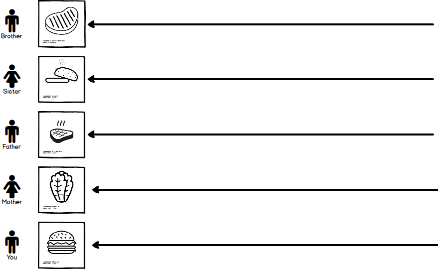
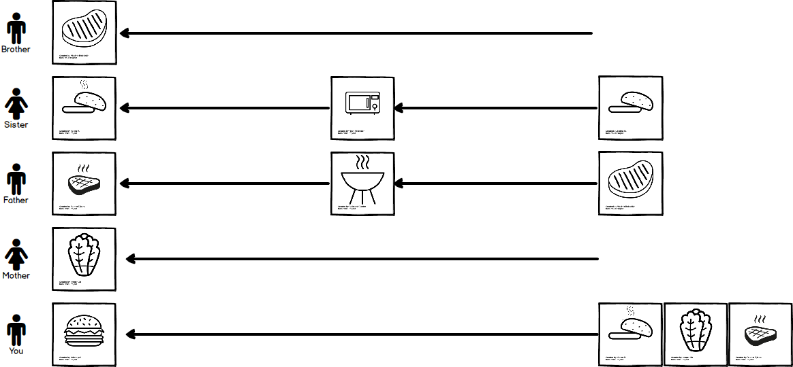
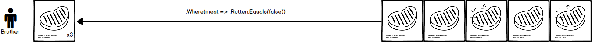
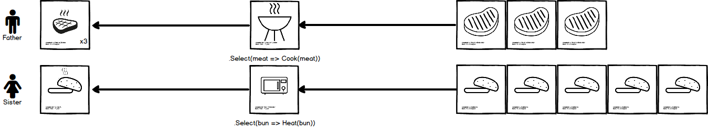
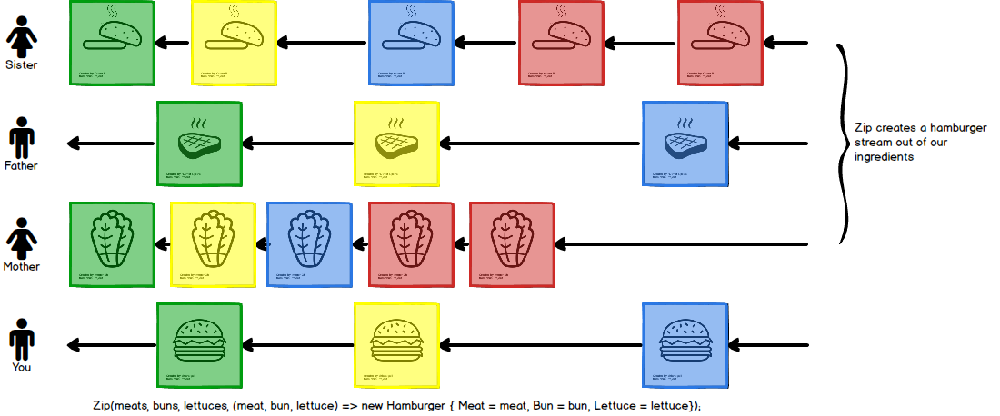

# Preface

One of my goals as a developer has been to learn what the big deal is regarding **RX(Reactive Extensions)**. I've always been interested in learning more about it, but I've had multiple learning blocks trying to wrap my head around it. I first started learning about **RX(Reactive Extensions)** back in 2013. It's been four years since and I'm still struggling to learn it. So I figured what better way to learn it other than writing about it?

## Why learn **RX(Reactive Extensions)** from a developer standpoint?

RX has slowly overtaken various development communities by storm. Here's a few reasons why I personally dived into RX.

- **Influencers have double downed on the framework**
    - <http://jakewharton.com/managing-the-reactive-world-with-rxjava/>
    - <http://ericsink.com/entries/dont_use_rxui.html>
    - <https://www.hanselman.com/blog/HanselminutesPodcast252ReactiveUIExtensionsToTheReactiveFrameworkRxWithPaulBetts.aspx>
- **Google has moved to a RX mindset with their new Architecture Components**
    - <https://developer.android.com/topic/libraries/architecture/guide.html>
- **Other languages/frameworks have implementations (Thus the knowledge is universal)**
    - <http://reactivex.io/languages.html>

## Okay...but Why?

I'm not going to convince you with a pros and cons list, but rather I'm going to give an example of how **RX** can help you.

## Scenario: Family BBQ

Imagine the application we are going to create mimics a family BBQ in which hamburgers are served. Let's give some roles to our family members based on what they are responsible for preparing.

- Brother - Responsible for preparing raw meat.
- Sister - Responsible for heating up buns.
- Father - Responsible for cooking the meat.
- Mother - Responsible for cutting fresh vegetables.
- You - Responsible for putting everything together to make a hamburger.

### Brother

Brother is taking out raw meat packages from the freezer and following a few steps:

1. Making sure the meat has not gone bad.
2. Seasoning the meat.
3. Rolling the meat into patties.

It takes Brother 3 seconds to prepare each piece of meat.

**In short: He is checking that the meat is not `Rotten` and then preparing each piece in 3 seconds.**

### Sister

Sister is taking buns out of the freezer and following a couple of steps:

1. Defrosting the buns.
2. Heating up the buns.

It takes Sister 5 seconds to heat each bun.

**In short: She is `Heating` the buns which takes 5 seconds each.**

### Father

Father is near the grill ready to cook and following a couple of steps:

1. Waiting for `Brother` to prepare the meat.
2. Cooking each piece of meat as it comes to him.

Father is fast! It doesn't take him anytime to cook the meat.

**In short: He is `Cooking` the raw meat when brother provides it as soon as possible.**

### Mother

Mother is cutting up lettuce and following a couple of steps:

1. Making sure the lettuce has not gone bad.
2. Removing the outer leaves and core from the lettuce head
3. Chop the lettuce

It takes Mother 2 seconds to prepare the lettuce.

**In short: She is preparing the lettuce which takes 2 seconds.**

### You

You are waiting for your family to finish all of their tasks so you can do yours.

**In short: You will be taking a `Cooked Meat`, `Heated Bun`, and `Lettuce` to create a `Hamburger` as soon as you get each ingredient.**

## Streams

You may also notice that each one of our family members have a role in which they are **producing** something. However each stream has a different set of dependencies, filters, transformations, and combinations they must adhere to. Each stream also might take different amounts of time to complete.

## Filters

This is a way to ensure that we are assembling a perfectly edible hamburger so we do not get sick during our family BBQ. 

We only have one example of a filter in this sample:

Brother - Checks to ensure each meat is not `Rotten`.

## Transformations

We are also transforming our ingredients to different states. 

We have two examples of tranformations in this sample:

Father - Puts the raw meat on the grill which makes them `Cooked`.

Sister - Puts the buns in the microwave which make them `Heated`.

## Combinations

Now we need to finally create our hamburger based on the other streams our family is producing. I've color coordinated each ingredient to show what hamburger it belongs to. The items marked in `Red` sadly get discarded because we don't have enough `Meat` that is `Cooked`, sadly `Brother` has already thrown away the `Rotten` meat.

## The Code

You can find the code which you can run locally in Visual Studio or LINQPad here:

<https://gist.github.com/JonDouglas/56b61d43c60d987efeef7c9d294adfe8>

## Summary

It took me over 4 years to realize that **Reactive Extensions(RX)** is a _good_ idea. It's never to late to start learning something new.